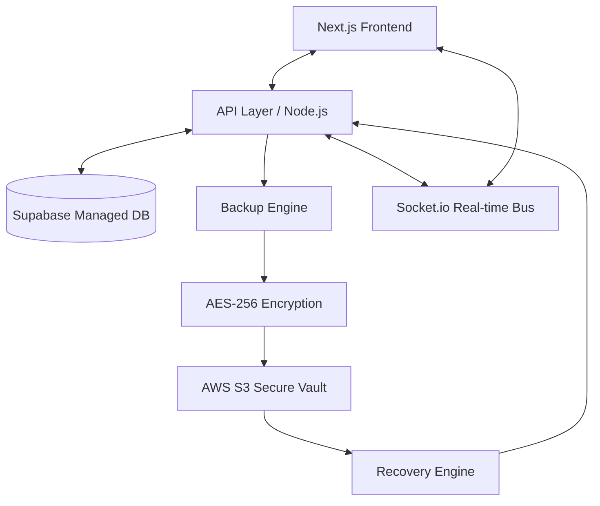

# 🛡️ Cloud System: Comprehensive Architecture & Recovery Report

## 1. Project Overview
The **Cloud System** is a mission-critical infrastructure management platform designed to provide ultra-secure, automated backups and lightning-fast disaster recovery for educational registries. The core philosophy of the system is **"Zero-Loss Integrity"**—ensuring that even in the event of accidental deletions or system-wide corruption, the state of the registry can be perfectly reconstructed in seconds.

---

## 2. System Architecture
The system utilizes a **Hybrid Cloud-Edge** architecture, balancing the performance of local operations with the durability of global cloud storage.

---

## 3. Component Breakdown

### 📂 Application Layer (`app/`)
- **Dashboard**: Provides a real-time overview of the registry health, student counts, and storage utilization.
- **School Registry**: The primary interface for managing student and staff records. Every successful registration here triggers a background backup sequence.
- **Recovery Hub**: The mission-control center for restoration. It allows administrators to browse "Point-in-Time" snapshots and initiate infrastructure rebuilds.
- **Audit Logs**: A transparency layer that records every system action, backup, and restore attempt for compliance and debugging.

### ⚙️ Core Engines (`lib/`)
- **`backup/engine.ts` (The Guardian)**: Generates high-reliability SQL dumps. It detects changes in the registry and automatically labels backups with context (e.g., *"Post-Registration: Lillian"*).
- **`restore/engine.ts` (The Reconstructor)**: A dual-engine handler that supports both binary and SQL recovery paths. It performs an atomic "Purge-and-Inject" sequence to rebuild the database schema without manual intervention.
- **`encryption.ts`**: Implements industrial-grade AES-256-GCM encryption. All data is encrypted before transmission, ensuring that the cloud provider (AWS) never sees the raw registry data.

---

## 4. Page Synergy & Navigation Flow
The system is designed as a cohesive ecosystem where data flows seamlessly between modules:
1. **Entry**: Admin registers a student on the **School Page**.
2. **Trigger**: The **API Layer** commits the record to **Supabase** and simultaneously signals the **Backup Engine**.
3. **Storage**: The backup is encrypted and vaulted in **AWS S3**, while a reference is saved in the **Backups Page**.
4. **Disaster**: If a record is accidentally deleted, the admin visits the **Recovery Page**.
5. **Recovery**: Selecting a snapshot initiates the **Restore Engine**, which uses **Socket.io** to stream kernel-style logs back to the **Restore Overlay** UI in real-time.

---

## 5. Engineering Hurdles & Resolved Issues

### 🔴 The Silent Rollback Bug
- **Issue**: Restoration showed "Success," but data didn't appear.
- **Cause**: Binary restores were conflicting with existing system tables, causing a silent database rollback.
- **Solution**: Developed a **SQL-Stream Injection** engine that explicitly excludes system tables from the restore path, ensuring application data (like student records) is always prioritized.

### 🔴 Shell Expansion Conflict
- **Issue**: Cryptic syntax errors during data purging.
- **Cause**: PostgreSQL `$$` delimiters were being intercepted by the system shell.
- **Solution**: Implemented **Double-Escaped Literals** (`\\$\\$`) to bypass shell interpretation.

### 🔴 Database Lock contention
- **Issue**: The restoration process would "hang" indefinitely.
- **Cause**: Background connections were locking tables required for the rebuild.
- **Solution**: Implemented **Active Lock Management** with a 15-second timeout and connection-cleanup logic to force-priority to the restoration engine.

---

## 6. Advantages of the Cloud-Native Approach
1. **Physical Isolation**: By offloading backups to AWS S3, the system is immune to local hardware failures.
2. **Infinite Versioning**: The system maintains an immutable history of every registration, allowing "Time-Travel" recovery to any known good state.
3. **Zero-Knowledge Privacy**: Since the system encrypts data locally before upload, the cloud storage acts as a "Dark Vault"—securing the data without ever having access to its content.

---

## 7. Conclusion
The Cloud System represents a robust, scalable solution for modern data management. Through the implementation of high-reliability SQL streaming and real-time monitoring, we have achieved a system that is not only secure but resilient against the most common technical failures in cloud environments.
